# Diffusion Transformer (DiT) in R Tensorflow
This repository is a R-Tensorflow implementation of [Diffusion Transformer](https://arxiv.org/abs/2212.09748). It contains the code of **AutoEncoder** and **DiT**.

## Detail
1. AutoEncoder is KL-VAE with the KL regularized loss and VGG19-based perceptual loss. VAE is used to compress images from pixel space to latent space. After the Encoder in VAE, the image resolution will be reduced by a factor of 8 (256x256 -> 32x32).
2. DiT consists of a series of DiT blocks with 260M parameters (width = 1024, num_heads = 16, num_layers = 16). The tags of images will be encoded by the 2 layers of Transformer encoder to get the "condition vector" (like  *\<cls\>* token in BERT or ViT).
3. This model is a **conditional** generative model (Classifier-Free Guidance, CFG). It can generate images conditionally given specific tags such as `blue hair, short hair, blush, smile` (better quality), or generate images unconditionally (lower quality). It also supports "**negative prompt**" to avoid things you don't want.
4. Regarding the sampler, I only implemented DDIM.
<div align="left">
  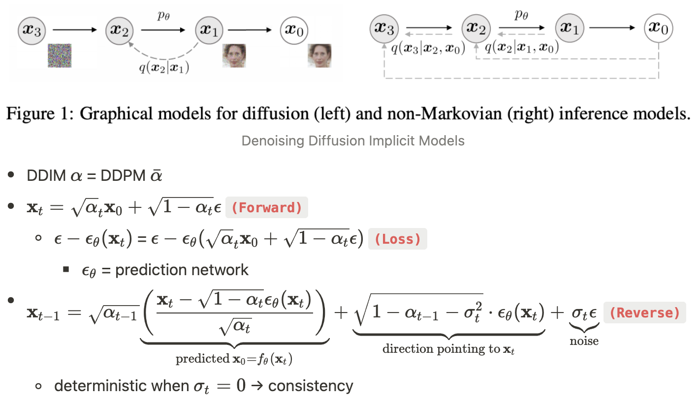
</div> (Source: https://github.com/taki0112/Diffusion-Tensorflow)

## Training set and results
 We train model with [140k images from 2018 Dannbooru](https://www.seeprettyface.com/mydataset_page3.html#anime) and get their tags by [WD 1.4 MOAT Tagger V2](https://huggingface.co/SmilingWolf/wd-v1-4-moat-tagger-v2). <br>


**Examples: <br>**
|  |  |   |
|:---:|:---:|:---:|
| Real image | step = 250, σ<sub>t</sub> = 1.0, <br> CFG = 4.0 (DDPM) | step = 50, σ<sub>t</sub> = 0.0, <br> CFG = 4.0 (DDIM) |
<div align="center">
hat, brown hair, smile, brown eyes, short hair, bow, shirt, ribbon, closed mouth, <br>collared shirt, blush, white shirt
</div>
<br>
<br>

|  |  |   |
|:---:|:---:|:---:|
| Real image | step = 250, σ<sub>t</sub> = 1.0, <br> CFG = 4.0 (DDPM) | step = 50, σ<sub>t</sub> = 0.0, <br> CFG = 4.0 (DDIM) |
<div align="center">
brown hair, long hair, mouth hold, school uniform, blush, ribbon, collared shirt, shirt, <br>white shirt, jacket, bangs, purple eyes, hair between eyes, brown eyes
</div>
<br>
<br>

| 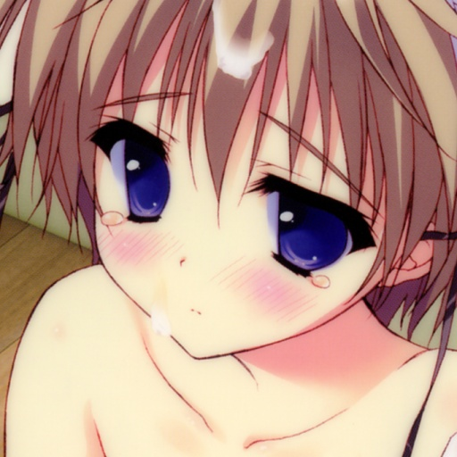 | 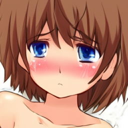 |   |
|:---:|:---:|:---:|
| Real image | step = 250, σ<sub>t</sub> = 1.0, <br> CFG = 4.0 (DDPM) | step = 50, σ<sub>t</sub> = 0.0, <br> CFG = 4.0 (DDIM) |
<div align="center">
blue eyes, blush, tears, bare shoulders, collarbone, brown hair, short hair
</div>
<br>
<br>

|  |  |   |
|:---:|:---:|:---:|
| Real image | step = 250, σ<sub>t</sub> = 1.0, <br> CFG = 4.0 (DDPM) | step = 50, σ<sub>t</sub> = 0.0, <br> CFG = 4.0 (DDIM) |
<div align="center">
glasses, smile, hair over one eye, purple eyes, necktie, short hair, <br>blush, closed mouth, pink hair, purple hair
</div>
<br>
<br>

| 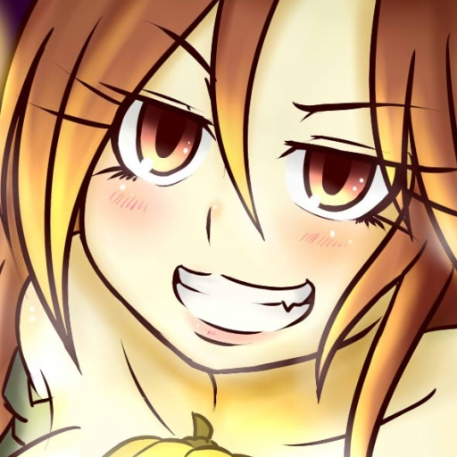 | 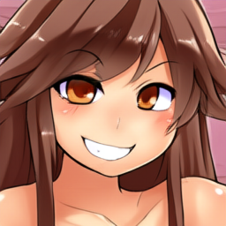 |  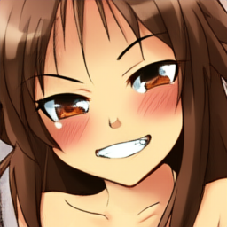 |
|:---:|:---:|:---:|
| Real image | step = 250, σ<sub>t</sub> = 1.0, <br> CFG = 4.0 (DDPM) | step = 50, σ<sub>t</sub> = 0.0, <br> CFG = 4.0 (DDIM) |
<div align="center">
smile, grin, long hair, fang, blush, bare shoulders, brown hair, collarbone, animal ears
</div>
<br>
<br>

| 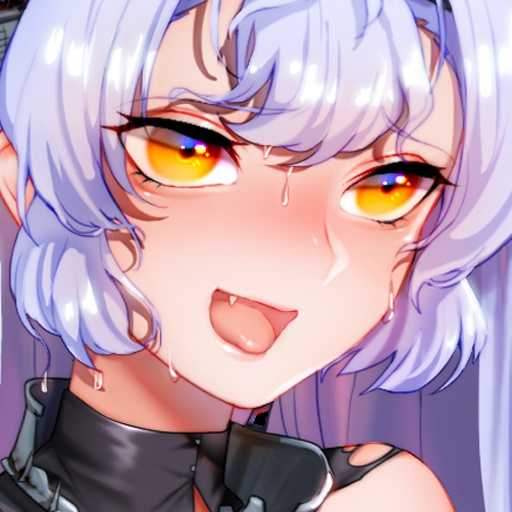 | 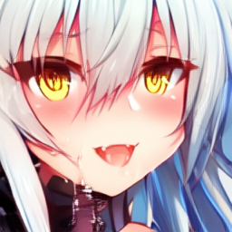 |  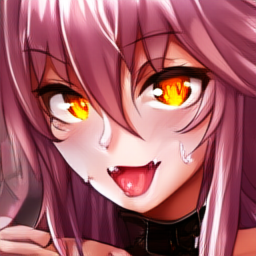 |
|:---:|:---:|:---:|
| Real image | step = 250, σ<sub>t</sub> = 1.0, <br> CFG = 4.0 (DDPM) | step = 50, σ<sub>t</sub> = 0.0, <br> CFG = 4.0 (DDIM) |
<div align="center">
open mouth, long hair, tongue, wet, smile, fang, bangs, yellow eyes, blush, <br>tongue out, hair between eyes, collar, orange eyes
</div>
<br>
<br>

|  |  |   |
|:---:|:---:|:---:|
| Real image | step = 250, σ<sub>t</sub> = 1.0, <br> CFG = 4.0 (DDPM) | step = 50, σ<sub>t</sub> = 0.0, <br> CFG = 4.0 (DDIM) |
<div align="center">
chibi, blue eyes, blush, :d, open mouth, smile, :3, fang, bangs, animal ears, <br>dress, bow, heart, long hair, hair between eyes
</div>
<br>
<br>

| 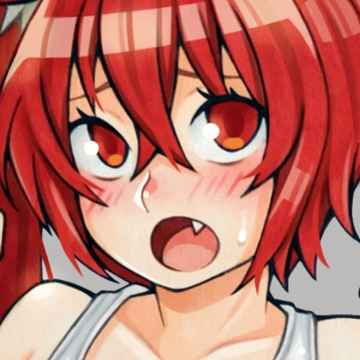 |  |  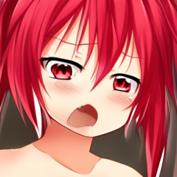 |
|:---:|:---:|:---:|
| Real image | step = 250, σ<sub>t</sub> = 1.0, <br> CFG = 4.0 (DDPM) | step = 50, σ<sub>t</sub> = 0.0, <br> CFG = 4.0 (DDIM) |
<div align="center">
fang, red eyes, red hair, blush, open mouth, side ponytail, long hair, bare shoulders, collarbone
</div>
<br>
<br>

|  |  |   |
|:---:|:---:|:---:|
| Real image | step = 250, σ<sub>t</sub> = 1.0, <br> CFG = 4.0 (DDPM) | step = 50, σ<sub>t</sub> = 0.0, <br> CFG = 4.0 (DDIM) |
<div align="center">
mole, mole under eye, school uniform, long hair, serafuku, green eyes, <br>blue hair, blush, sailor collar, star (symbol), :o
</div>
<br>

## Discussion
1. It's obvious that the tags of some images are wrong and couldn't describe the image completely.
2. I think that 260M parameters are already the limit on this dataset. I also found that `weight_decay` in AdamW should be initially set to 1e-4 instead of 1e-2.
3. In my implementation, DiT uses the L<sub>simple</sub> loss instead of the L<sub>hybrid</sub> loss proposed in [improved DDPM](https://arxiv.org/abs/2102.09672). The implementation of L<sub>hybrid</sub> loss is quite complex, and I am not sure if it can effectively improve the diversity and quality of generated images.

## Requirements
The model is based on [Tensorflow for R](https://github.com/rstudio/tensorflow). The code was tested with R 4.3.1 and Python 3.9.17.
The required R packages listed as follows:
- Tensorflow 2.13+ ([Install in R](https://tensorflow.rstudio.com/install/))
- Keras 2.13+
- EBImage

## Usage
### Training
1. Prepare for images used for training.
    - Make sure that image's width is equal to height.
2. Change the hyperparameters and train VAE.
    ```
    Rscript train_vae.R
    ```
3. Compute the scale factor. Remember it.
    ```
    Rscript scale_factor.R
    ```
4. Change the hyperparameters and train DiT.
    ```
    Rscript train_DiT.R
    ```

### Inference
Use `Inference.Rmd` to load model DiT `ema_DiT(Epoch 100)` and VAE `VAE-f8`.

## References
- [High-Resolution Image Synthesis with Latent Diffusion Models](https://arxiv.org/abs/2112.10752)
- [Denoising Diffusion Probabilistic Models](https://arxiv.org/abs/2006.11239)
- [Denoising Diffusion Implicit Models](https://arxiv.org/abs/2010.02502)
- [Improved Denoising Diffusion Probabilistic Models](https://arxiv.org/abs/2102.09672)
- [Scalable Diffusion Models with Transformers](https://arxiv.org/abs/2212.09748)
- https://github.com/facebookresearch/DiT
- https://github.com/taki0112/Diffusion-Tensorflow
- https://keras.io/examples/generative/ddim/
- https://github.com/beresandras/clear-diffusion-keras
- https://github.com/CompVis/stable-diffusion
